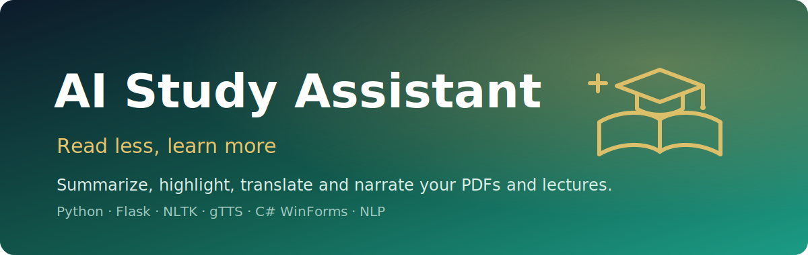

<p align="center">
  
</p>

<h1 align="center">AI-Powered Study Assistant</h1>

<p align="center"><em>Turn dense PDFs and recorded lectures into summaries, key points, Urdu translations and audio you can actually study from.</em></p>

<p align="center">
  
  
  
  
  
</p>

**AI-Powered Study Assistant** is a study companion that takes a **PDF document** or an **audio lecture**, extracts the text, and then lets you **summarize** it, **highlight key points**, **translate it to Urdu**, pull in **related Wikipedia resources**, and **export the result** as a PDF or a spoken audio file. It pairs a **Python / Flask** processing backend (using **NLTK** for extractive summarization, **PyPDF2** for PDF text, **SpeechRecognition** for audio-to-text, **googletrans** for translation, and **gTTS** for text-to-speech) with a small **C# WinForms** desktop launcher that handles file upload and starts the web app.

> Built to cut study time: feed it your reading or a recorded class, get back the parts that matter — in text or audio, in English or Urdu.

---

## ✨ Features

- **PDF & audio ingestion** — upload a PDF (PyPDF2) or an audio file (`.wav` / `.mp3`) and extract its text via Google SpeechRecognition.
- **Extractive summarization** — NLTK word-frequency scoring selects the most important sentences (≈ half the source length).
- **Key-point highlighting** — ranks sentences by unique-word density to surface the densest, most informative lines.
- **Urdu translation** — translates the extracted/processed text to Urdu with `googletrans`.
- **Resource recommendations** — searches Wikipedia for articles related to the extracted key points and returns titles + links.
- **Export** — save the processed text to **PDF** (FPDF) or to **spoken audio** (gTTS MP3).
- **Desktop launcher** — a C# WinForms app uploads your file into `saved/`, boots the Flask server, and opens the browser UI.

## 🏗️ Architecture

```
┌──────────────────────────┐        ┌───────────────────────────────────┐
│  C# WinForms launcher     │        │  Flask backend (app.py)           │
│  (.NET Framework 4.7.2)   │        │                                   │
│                           │        │   /            → extract text     │
│  • pick PDF / audio file  │  copy  │     • PyPDF2 (PDF → text)         │
│  • copy to ..\..\saved\   │ ─────▶ │     • SpeechRecognition (audio)   │
│  • launch  python app.py  │        │                                   │
│  • open browser           │        │   /process     → run an action    │
└──────────────────────────┘        │     • summarize   (NLTK)          │
                                     │     • highlight   (NLTK)          │
            ┌────────────────────┐   │     • translate   (googletrans)   │
            │  Browser UI        │◀──│     • resources   (wikipedia)     │
            │  templates/        │   │     • download_t  (FPDF → PDF)    │
            │  index.html        │──▶│     • download_a  (gTTS → MP3)    │
            └────────────────────┘   └───────────────────────────────────┘
```

The frontend (`templates/index.html`) shows the extracted text and posts the chosen action to `/process`, which returns the processed text as JSON.

## 🚀 Run it

The processing engine is the Flask app. You can run it directly (the C# launcher is just a convenience wrapper around it).

```bash
# 1. Get the source (the project lives inside projj.zip → FSE/a/a)
unzip projj.zip
cd FSE/a/a

# 2. Install the Python dependencies
pip install flask flask-cors PyPDF2 SpeechRecognition nltk \
            googletrans==4.0.0-rc1 wikipedia fpdf gTTS

# 3. Download the NLTK data used for tokenizing / stopwords
python -c "import nltk; nltk.download('punkt'); nltk.download('stopwords')"

# 4. Place a PDF at ../../saved/a.pdf (or audio at ../../saved/a.wav),
#    then start the server
python app.py
```

Then open <http://127.0.0.1:5000/> and use the buttons — Summarize, Highlight Keypoints, Urdu Translation, Resources, Download Text, Download Audio.

**Optional — desktop launcher:** open `FSE/a/a.sln` in Visual Studio (the app targets **.NET Framework 4.7.2** / Windows Forms), build, and run. Use *Upload* to pick a PDF or audio file; it copies the file into `saved/`, starts `app.py`, and opens the browser for you.

## 🔧 Config

- **Server:** `app.run(host='127.0.0.1', port=5000, debug=True)` — edit the bottom of `app.py` to change host/port or disable debug.
- **Input files:** the backend reads from `../../saved/a.pdf`, `../../saved/a.wav`, or `../../saved/a.mp3` relative to `app.py`. The C# launcher writes uploads there automatically.
- **Summary length:** summarization and key-point extraction default to roughly half the source sentences — tune `num_sentences` in `summarize_text()` / `extract_keypoints()`.
- **Translation language:** `translate_to_urdu()` targets `dest='ur'`; change the destination code in `app.py` for other languages.
- **TTS language:** `gTTS(text=text, lang='en')` — adjust `lang` for narration in another language.
